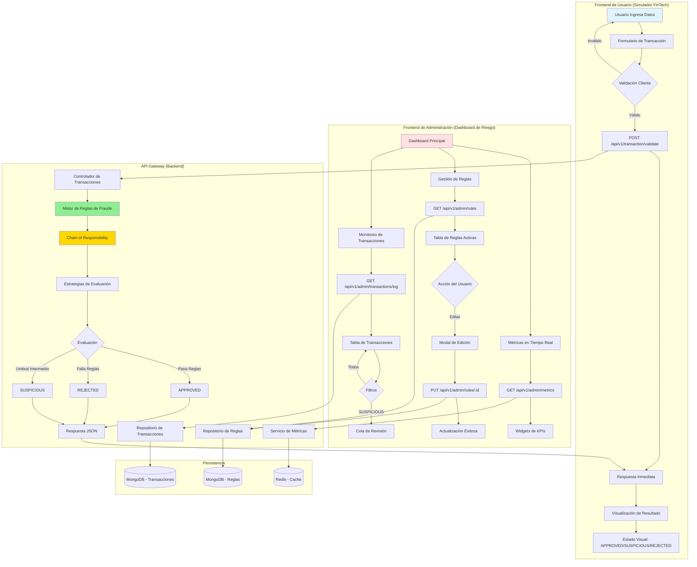
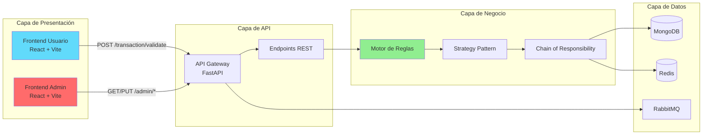

# 🎨 Arquitectura Frontend - Fraud Detection Engine

## 📊 Diagrama de Flujo de Datos



## 🏛️ Arquitectura de Sistemas



## 📡 Endpoints API Existentes y Nuevos

### ✅ Endpoints Existentes (Implementados)

| Método | Endpoint | Descripción | Frontend |
|--------|----------|-------------|----------|
| POST | `/transaction` | Recibe transacción (202 Accepted) | Usuario |
| GET | `/audit/all` | Consulta todas las evaluaciones | Admin |
| GET | `/audit/transaction/{id}` | Evaluación por ID | Admin |
| GET | `/audit/user/{user_id}` | Transacciones por usuario | Admin |
| PUT | `/transaction/review/{id}` | Revisión manual de transacción | Admin |
| GET | `/config/thresholds` | Consulta configuración de umbrales | Admin |
| PUT | `/config/thresholds` | Actualiza umbrales | Admin |
| GET | `/health` | Health check | Ambos |

### 🔄 Endpoints Necesarios (A Implementar)

| Método | Endpoint | Descripción | Payload | Respuesta |
|--------|----------|-------------|---------|-----------|
| **POST** | `/api/v1/transaction/validate` | **Validación sincrónica para simulador** | `{ amount, userId, location, deviceId }` | `{ status, riskScore, violations }` |
| **GET** | `/api/v1/admin/rules` | **Lista todas las reglas activas** | - | `[{ id, name, type, parameters, enabled, order }]` |
| **PUT** | `/api/v1/admin/rules/{ruleId}` | **Actualiza parámetros de regla** | `{ parameters }` | `{ success, rule }` |
| **GET** | `/api/v1/admin/transactions/log` | **Log completo de transacciones** | Query: `?status=SUSPICIOUS&limit=100` | `[{ id, amount, date, status, violations }]` |
| **GET** | `/api/v1/admin/metrics` | **KPIs del sistema** | - | `{ totalTransactions, blockedRate, suspiciousRate, avgRiskScore }` |
| **POST** | `/api/v1/admin/rules/reorder` | **Reordena Chain of Responsibility** | `{ ruleIds: [] }` | `{ success, newOrder }` |

## 🎯 Especificaciones Detalladas

### Frontend Usuario (Simulador)

#### Objetivo
Simular la experiencia de un usuario final realizando una transacción en una app FinTech moderna.

#### Pantalla Principal: Simulador de Transacción

**Componentes:**
1. **Formulario de Transacción**
   - Campo: Monto ($) - Input numérico con formato de moneda
   - Campo: User ID - Input de texto
   - Campo: Ubicación - Input de texto o selector de mapa
   - Campo: Device ID - Input de texto
   - Botón: "Realizar Transacción" (CTA principal)

2. **Zona de Resultado**
   - **Estado APPROVED**: 
     - Ícono: ✓ círculo verde
     - Mensaje: "Transacción aprobada"
     - Risk Score: Barra de progreso verde (0-30%)
   - **Estado SUSPICIOUS**: 
     - Ícono: ⚠ círculo amarillo
     - Mensaje: "Transacción en revisión"
     - Risk Score: Barra de progreso amarilla (31-70%)
     - Lista de violaciones encontradas
   - **Estado REJECTED**: 
     - Ícono: ✗ círculo rojo
     - Mensaje: "Transacción rechazada"
     - Risk Score: Barra de progreso roja (71-100%)
     - Lista de violaciones encontradas

#### Flujo de Usuario
```
1. Usuario completa formulario
2. Click en "Realizar Transacción"
3. Loading spinner (0.5-2s)
4. Animación de transición
5. Resultado visual con Risk Score animado
6. Botón "Nueva Transacción" para limpiar formulario
```

---

### Frontend Admin (Dashboard de Riesgo)

#### Objetivo
Proporcionar herramientas completas de monitoreo y gestión para analistas de riesgo.

#### Pantalla 1: Dashboard Principal

**Layout:**
```
┌─────────────────────────────────────────────────────┐
│  [Logo]  Fraud Detection Admin    [User] [Settings] │
├─────────────────────────────────────────────────────┤
│  Dashboard  │  Reglas  │  Transacciones  │  Config  │
├───────────────┬─────────────┬───────────────────────┤
│  Total Trans  │  % Blocked  │  % In Review          │
│    12,453     │    2.3%     │    5.7%               │
├───────────────┴─────────────┴───────────────────────┤
│  [Gráfico de Tendencia de Riesgo - Últimas 24h]     │
│                                                       │
├───────────────────────────────────────────────────────┤
│  Transacciones Recientes                             │
│  [Tabla con últimas 10 transacciones]                │
└───────────────────────────────────────────────────────┘
```

**Componentes:**
1. **KPI Cards** (4 widgets)
   - Total de Transacciones (hoy)
   - % Transacciones Bloqueadas
   - % En Revisión Manual
   - Risk Score Promedio

2. **Gráfico de Línea de Tiempo**
   - Eje X: Tiempo (últimas 24h)
   - Eje Y: Cantidad de transacciones
   - 3 líneas: Approved (verde), Suspicious (amarillo), Rejected (rojo)

3. **Tabla de Transacciones Recientes**
   - Columnas: ID | Monto | Usuario | Fecha/Hora | Estado | Acciones
   - Filtros rápidos: Todas | Sospechosas | Rechazadas
   - Paginación: 10 por página

#### Pantalla 2: Gestión de Reglas

**Layout:**
```
┌─────────────────────────────────────────────────────┐
│  Reglas de Fraude                [+ Nueva Regla]    │
├─────────────────────────────────────────────────────┤
│  ┌─────────────────────────────────────────────┐    │
│  │ ☰ RuleMontoAlto              [Edit] [⚙]    │    │
│  │   Threshold: $1,500          Enabled: ✓     │    │
│  │   Priority: 1                                │    │
│  └─────────────────────────────────────────────┘    │
│  ┌─────────────────────────────────────────────┐    │
│  │ ☰ RuleUbicacionInusual       [Edit] [⚙]    │    │
│  │   Radius: 100 km             Enabled: ✓     │    │
│  │   Priority: 2                                │    │
│  └─────────────────────────────────────────────┘    │
│                                                      │
│  [Guardar Orden]                                     │
└─────────────────────────────────────────────────────┘
```

**Componentes:**
1. **Lista de Reglas (Drag & Drop)**
   - Cada regla es una card expandible
   - Icono de drag handle (☰) para reordenar
   - Toggle para habilitar/deshabilitar
   - Botón "Edit" abre modal

2. **Modal de Edición de Regla**
   ```
   ┌───────────────────────────────┐
   │ Editar Regla: RuleMontoAlto   │
   ├───────────────────────────────┤
   │ Nombre: [RuleMontoAlto    ]   │
   │ Tipo:   [Amount Threshold  ▼] │
   │ Threshold: [$ 1500.00     ]   │
   │ Enabled:   [✓ Activa]         │
   │                               │
   │ [Cancelar]  [Guardar Cambios] │
   └───────────────────────────────┘
   ```

3. **Botón de Guardar Orden**
   - Llama a `POST /api/v1/admin/rules/reorder`
   - Actualiza el Chain of Responsibility

#### Pantalla 3: Log de Transacciones

**Layout:**
```
┌─────────────────────────────────────────────────────┐
│  Log de Transacciones                               │
├─────────────────────────────────────────────────────┤
│  Filtros: [Todas ▼] [Fecha ▼] [Usuario: ____]      │
├───┬──────┬────────┬──────────┬─────────┬──────────┤
│ ID│Monto │Usuario │Fecha/Hora│Estado   │Violaciones│
├───┼──────┼────────┼──────────┼─────────┼──────────┤
│123│$2,300│user_01 │01/07 14:32│REJECTED│Monto,Ubic│
│124│$  450│user_02 │01/07 14:30│APPROVED│-         │
│125│$1,800│user_03 │01/07 14:28│SUSPICIOUS│Ubicación│
└───┴──────┴────────┴──────────┴─────────┴──────────┘
```

**Componentes:**
1. **Filtros Avanzados**
   - Dropdown: Estado (Todas / Approved / Suspicious / Rejected)
   - Date Picker: Rango de fechas
   - Input: Filtro por User ID

2. **Tabla de Datos**
   - Columnas ordenables (click en header)
   - Color coding por estado:
     - Verde: APPROVED
     - Amarillo: SUSPICIOUS
     - Rojo: REJECTED
   - Columna de violaciones con badges/tags
   - Click en fila para ver detalles completos

3. **Cola de Sospechosas (Sidebar)**
   ```
   ┌────────────────────┐
   │ En Revisión (23)   │
   ├────────────────────┤
   │ #125 - $1,800      │
   │ [Ver] [Aprobar]    │
   ├────────────────────┤
   │ #130 - $2,100      │
   │ [Ver] [Aprobar]    │
   └────────────────────┘
   ```

## 🎨 Guía de Diseño Visual

### Paleta de Colores

#### Frontend Usuario (Tema Claro)
- **Primario**: `#4F46E5` (Índigo) - Botones principales
- **Secundario**: `#10B981` (Verde) - Aprobado
- **Warning**: `#F59E0B` (Ámbar) - Sospechoso
- **Error**: `#EF4444` (Rojo) - Rechazado
- **Background**: `#F9FAFB` (Gris muy claro)
- **Text**: `#111827` (Gris oscuro)

#### Frontend Admin (Tema Oscuro)
- **Primario**: `#6366F1` (Índigo claro)
- **Secundario**: `#10B981` (Verde)
- **Warning**: `#FBBF24` (Ámbar)
- **Error**: `#F87171` (Rojo)
- **Background**: `#1F2937` (Gris oscuro)
- **Surface**: `#374151` (Gris medio)
- **Text**: `#F9FAFB` (Blanco roto)

### Tipografía
- **Familia**: Inter (sans-serif) - excelente legibilidad
- **Tamaños**:
  - Headings: 24px (bold), 20px (semibold), 16px (medium)
  - Body: 14px (regular)
  - Captions: 12px (regular)

### Espaciado
- Sistema de 8px grid: 8, 16, 24, 32, 48, 64

### Componentes UI
- **Cards**: Border radius 8px, shadow suave
- **Botones**: Border radius 6px, altura 40px
- **Inputs**: Border radius 6px, altura 40px
- **Modals**: Max-width 500px, overlay semi-transparente

## 🔐 Consideraciones de Seguridad

1. **Autenticación**: Header `X-Analyst-ID` para endpoints admin
2. **CORS**: Configurar orígenes permitidos en producción
3. **Rate Limiting**: Implementar throttling en endpoints críticos
4. **Validación**: Doble validación (cliente + servidor)
5. **Sanitización**: Escapar inputs para prevenir XSS

## 📱 Responsividad

### Breakpoints
- **Mobile**: < 640px (Stack vertical de componentes)
- **Tablet**: 640px - 1024px (Layout adaptado)
- **Desktop**: > 1024px (Layout completo)

### Prioridades Mobile-First
- Frontend Usuario: Optimizar para mobile (uso principal en dispositivos)
- Frontend Admin: Optimizar para desktop (uso en oficina)

## ⚡ Performance

1. **Code Splitting**: Lazy loading de rutas
2. **Caching**: Cache de reglas en localStorage
3. **Debouncing**: En filtros de búsqueda (300ms)
4. **Optimistic UI**: Actualizar UI antes de respuesta del servidor
5. **Skeleton Screens**: Mientras carga datos

## 🧪 Testing

1. **Unit Tests**: Jest + React Testing Library
2. **E2E Tests**: Playwright
3. **Accessibility**: Axe-core para cumplir WCAG 2.1 AA

---

**Documento creado**: 2026-01-07  
**Autor**: María Gutiérrez (con asistencia de GitHub Copilot)  
**Versión**: 1.0
